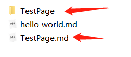
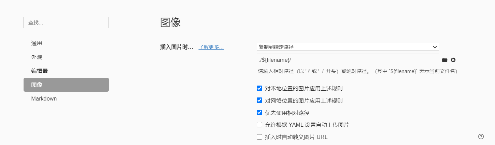

这是通过 `hexo new TestPage` 命令所创建的一篇文章，存放在source目录下的_posts.

贴张图片测试一下能不能成功显示出来：👇


<!--more-->

若图片显示不出来，则在`站点根目录`下安装插件

```bash
npm install https://github.com/CodeFalling/hexo-asset-image --save
```

修改`站点配置文件`

```bash
post_asset_folder: true
marked:
  prependRoot: true
  postAsset: true
```

这样在创建文章时，会同样生成一个同名文件夹



由于hexo生成的是.md文件，所以下载Typora进行文本编辑是一个很好的选择。从typora左上角的文件->偏好设置->图像里，在`插入图片时`那里改成复制到指定路径，并勾选上前三项



~~当把图片复制到xxx文章后，图片会自动变为  \!\[](xxx/图片名.图片类型)，最后把xxx/去掉即可。~~

(第一次测试时去掉xxx/是可行的，后面又不行，因此重新加回xxx/)