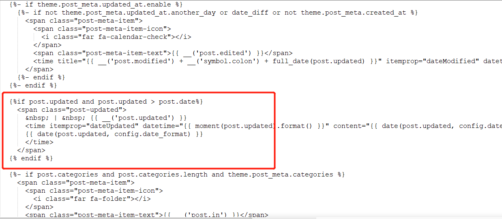
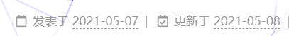

鉴于网上的文章许多都是通过修改`/themes/next/layout/_macro/post.swig`，并在`<span class="post-time">...</span>`标签后添加一段代码，但是现在的版本找不到swig文件。

<!--more-->

## 初始方法(不需要)

~~经过几番查找和试验，可以`themes\next\layout\_partials\post\post-meta.njk`进行修改，并在如图所示的地方加入该代码：~~



~~代码如下：~~

```html

  <span class="post-updated">
    &nbsp; | &nbsp; {{ __('post.updated') }}
    <time itemprop="dateUpdated" datetime="{{ moment(post.updated).format() }}" content="{{ date(post.updated, config.date_format) }}">
      {{ date(post.updated, config.date_format) }}
    </time>
  </span>

```

在你所对应的`language`配置文件(我的是zh-CN，目录为themes/next/languages/zh-CN.yml)添加或修改如下字段

```yml
post:
  updated: 更新于
```

在`主题配置文件`(/themes/next/_config.yml)中加入如下一行代码

```yml
display_updated: true
```


这样更新时间就能显示出来了。



------

## 现方法

后面的测试莫名其妙地发现不用加上面那一大段代码。

在`主题配置文件`(/themes/next/_config.yml)中加入如下一行代码和修改post_meta的update_at

```yml
#可以加在最后一行
display_updated: true

#修改update_at
post_meta:
 updated_at:
     enable: true
     another_day: true
```

在你所对应的`language`配置文件(我的是zh-CN，目录为themes/next/languages/zh-CN.yml)添加或修改如下字段

```yml
post:
  updated: 更新于
```


