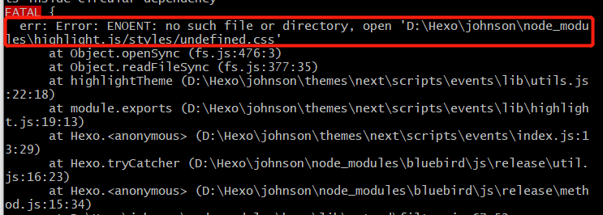
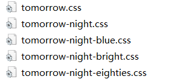

看到网上别人博客的代码块都是Mac风格＋黑底，于是乎我也整一波，但是发现按照网上的来修改highlight_theme还是不得行，主要是网上的大部分是旧版的，跟现版本的配置文件有点出入，于是在看了一堆博客和分析报错原因后，我找到了实现的办法。



<!--more-->

通过 [樱井喵](https://miaosakurai.com/) 的这一篇 [博客](https://miaosakurai.com/2020/04/20/Hexo-NexT%E7%BE%8E%E5%8C%96%F0%9F%8D%95Mac-Panel%E9%A3%8E%E6%A0%BC%E4%BB%A3%E7%A0%81%E5%9D%97%E9%85%8D%E7%BD%AE/) ，直接在 `主题配置文件`配置一下 `codeblock.copy_button.style: mac`就行了

```yaml
copy_button:
    enable: true
    show_result: true
    # Available values: default | flat | mac
    style: mac
```

要实现上面代码块的样式，我们可以在`站点目录\node_modules\highlight.js\styles`里发现有许多中css样式(tomorrow-theme也在其中)



我们找到`主题配置文件`中的theme，把light和dark都改成上述文件夹里的某种样式就行了，我用的是tomorrow-night-bright，也就是本文代码块的样式。

```yaml
theme:
    light: tomorrow-night-bright
    dark: tomorrow-night-bright
```

不过这种会对小代码块也同样生效，暂时我还没找到方法，等待后面找到了我再进行一波更新。


在报错中我也找到了一个highlight.js的地址：`站点目录\themes\next\scripts\events\lib\highlight.js`