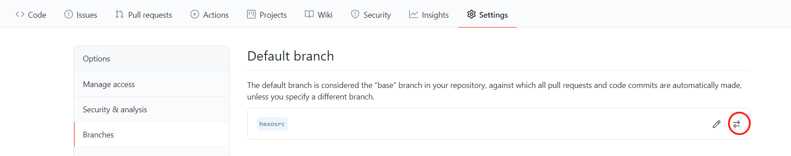
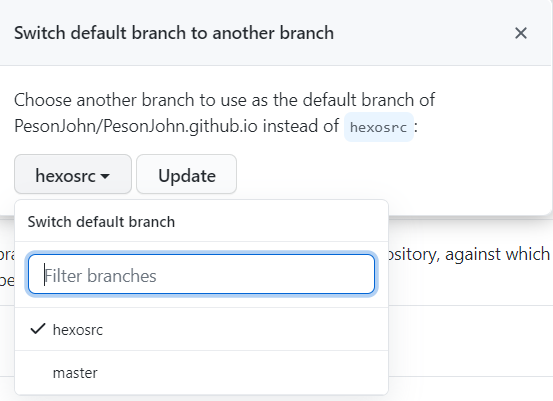

为了防止日后出现换电脑的情况而导致自己的配置文件和一些文档消失，所以创建一个分支存放源文件是有必要的，当然你也可以选择存放到云盘，只要你记得更新就是了。创建分支存放的方法其实也不是很复杂。

<!--more-->

## 初始化版本库并与远程仓库关联

一般按照网上方法所创建的博客是没有与远程仓库建立关联的，通过几个git命令来进行关联。

```bash
//将你的本地文件夹初始化成一个版本库
git init

//用 git remote add origin 你的github仓库地址 命令来建立与远程仓库的关联，这里的 origin 是你定义的远程仓库在本地的名字，你也可以叫别的，一般命名成 origin
git remote add origin "你的仓库地址"
```

## 创建并切换分支，提交文件

创建并切换分支：

```bash
git checkout -b "新分支名"
```

提交文件：

```bash
git add .

git commit -m"源文件"

git push origin "新分支名"
```

## 在GitHub中更改新分支为默认分支

把新建的分支设置成 默认分支，这样做的原因可以让你以后在别的机器上pull的时候能够直接拉取源文件，不用再指定分支。

在GitHub中进入settings中的branches，点击双向箭头进行切换。



选中新创分支并点击Update



它会弹出一个红色的经过，直接sure就行了。

## 后续日常管理操作

只要你的`站点配置文件`里deploy的branch是master，在你执行`hexo g -d`后也同样会更新。在你进行了文章添加修改或修改样式等改动后，通过下面流程进行管理：

1. 依次执行`git add .` 、`git commit -m"xxx"`、`git push origin 新创分支名`推送到GitHub(注意此时当前分支是你新创的分支)。
2. 执行`hexo g -d`发布网站到master分支上

建议不要调转这两者的顺序

## 在其他电脑修改博客

通过git clone将仓库拉下来(默认分支为你当时新创的分支)

然后在你copy下来的仓库文件夹通过git bash执行一下指令：`npm install hexo`、`npm install`、`npm install hexo-deployer-git`（不需要`hexo init`）。